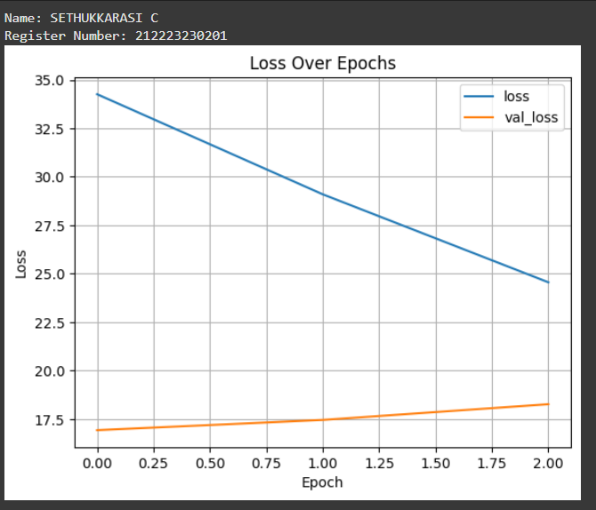
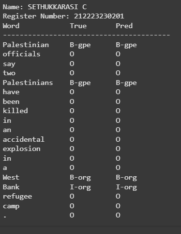

# Named Entity Recognition

## AIM

To develop an LSTM-based model for recognizing the named entities in the text.

## Problem Statement and Dataset
Build an LSTM-based model for named entity recognition using the ner_dataset.csv, leveraging words and NER tags as key features.

## DESIGN STEPS


### STEP 1: 
Import the necessary libraries to set up the environment.

### STEP 2: 
Load and preprocess the dataset by reading and cleaning the input data.

### STEP 3: 
Organize the data into sentences with corresponding word-tag pairs.

### STEP 4: 
Map words and tags to indices using predefined vocabulary dictionaries.

### STEP 5: 
Prepare the data by padding sequences, converting them into tensors, and batching them.

### STEP 6: 
Build the model using Embedding, BiLSTM, and Linear layers.

### STEP 7: 
Train the model by adjusting weights using loss functions and an optimizer.

### STEP 8: 
Evaluate performance on validation data after each epoch.

### STEP 9: 
Visualize results by displaying predictions or plotting loss curves.

## PROGRAM
### Name: SETHUKKARASI C
### Register Number: 212223230201
```python
class BiLSTMTagger(nn.Module):
  def __init__(self, vocab_size, tagset_size, embedding_dim = 50, hidden_dim = 100):
    super(BiLSTMTagger, self).__init__()
    self.embedding = nn.Embedding(vocab_size, embedding_dim)
    self.dropout = nn.Dropout(0,1)
    self.lstm = nn.LSTM(embedding_dim, hidden_dim, bidirectional=True, batch_first=True)
    self.fc = nn.Linear(hidden_dim * 2, tagset_size)

  def forward(self, x):
    x = self.embedding(x)
    x = self.dropout(x)
    x, _ = self.lstm(x)
    return self.fc(x)      

model = BiLSTMTagger(len(word2idx)+1, len(tag2idx)).to(device)
loss_fn = nn.CrossEntropyLoss()
optimizer = torch.optim.Adam(model.parameters(), lr=0.001)

# Training and Evaluation Functions
def train_model(model, train_loader, test_loader, loss_fn, optimizer, epochs=3):
    train_losses, val_losses = [], []
    for epoch in range(epochs):
      model.train()
      total_loss = 0
      for batch in train_loader:
        input_ids = batch["input_ids"].to(device)
        labels = batch["labels"].to(device)
        optimizer.zero_grad()
        outputs = model(input_ids)
        loss = loss_fn(outputs.view(-1, len(tag2idx)), labels.view(-1))
        loss.backward()
        optimizer.step()
        total_loss += loss.item()
      train_losses.append(total_loss)

      model.eval()
      val_loss = 0
      with torch.no_grad():
        for batch in test_loader:
          input_ids = batch["input_ids"].to(device)
          labels = batch['labels'].to(device)
          outputs = model(input_ids)
          loss = loss_fn(outputs.view(-1, len(tag2idx)), labels.view(-1))
          val_loss += loss.item()
      val_losses.append(val_loss)
      print(f"Epoch {epoch+1}: Train Loss = {total_loss:.4f}, Val Loss = {val_loss:.4f}")          

    return train_losses, val_losses

```
## OUTPUT

### Training Loss, Validation Loss Vs Iteration Plot



### Sample Text Prediction


## RESULT
Thus the LSTM-based Named Entity Recognition (NER) model was successfully developed and trained.